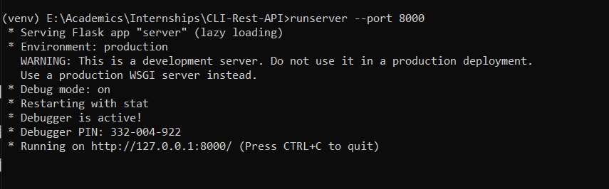
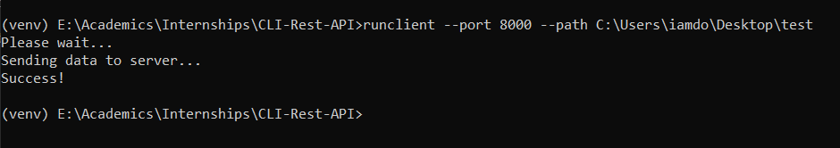

# CLI-Rest-API
A simple CLI Rest-API, developed by using Flask :+1:

## Initial Setup,
- Firstly, clone the project into your directory.

        git commit https://github.com/iamdonmathew/CLI-Rest-API.git
        
- Then, open cmd from the project location.
- Create a virtual environment.

        virtualenv venv
        
- After creating the virtual env, activate the environment by using the cmd.

        venv\Scripts\activate
        
- Next, we need to install some dependencies, to do that in cmd, type:

        pip install -e .
        
- **[OPTIONAL]** If the above code shows an error, then we must install an dditional package, so:

        pip install setuptools
        

## To Run,
Inorder to run the project, we need to open 2 cmd's in the same location, and activate the virtual environment:

- Then,
  - Initialy, we need to run the server, to do that, on the cmd, type:
        
        runserver --help
        runserver --port <port_number>
        
  - This will run the server on the specified port number
  - Then, we need to run the client, to do that, on the next cmd, type:
  
        runclient --help
        runclient --port <port_number> --path <location_to_display>
       
- **E.g:,**
- **runserver**
        

        
- **runclient**
       

  
- After this, we can open the web browser and type,
    
       localhost:<port-number>
       
- Thats It, you can see the result. :+1:
